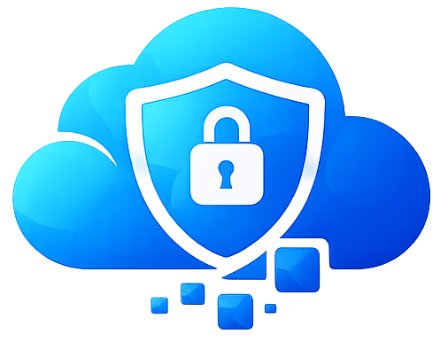

<p align="center">
  
</p>

<h1 align="center">BlockSky</h1>

<p align="center">
  <strong>🛡️ Take control of your Bluesky experience</strong><br/>
  Mass block followers of problematic accounts with one click.
</p>

<p align="center">
  <a href="https://blocksky.app">🌐 blocksky.app</a> •
  <a href="https://ko-fi.com/blockskyapp">☕ Support Us</a> •
  <a href="https://github.com/kevenages/blocksky/issues">🐛 Report Issues</a>
</p>

<p align="center">
  
  
  
  
</p>

---

## ✨ What is BlockSky?

Tired of blocking accounts one by one? **BlockSky** lets you mass block all followers (or following) of any account in seconds. Perfect for protecting yourself from harassment campaigns, bot networks, or toxic communities.

Your **mutuals are always protected** — we'll never block someone you follow who follows you back.

---

## 🚀 Features

- **⚡ Mass Blocking** — Block hundreds or thousands of accounts with one click
- **🤝 Mutual Protection** — Your mutuals are automatically skipped
- **✅ Whitelist Protection** — Official Bluesky accounts are never blocked
- **🔐 Two Login Options** — Choose OAuth (most secure) or App Password (faster)
- **📊 Real-time Progress** — Watch live as accounts are blocked
- **🔄 Auto-Resume** — Rate limited? We'll automatically continue when ready

---

## 🔑 Login Options

### Quick Login (OAuth)
The **most secure** option. You authenticate directly with Bluesky — your credentials never touch BlockSky. May hit rate limits sooner.

### App Password
**Faster blocking** with higher rate limits. Create an app password in your Bluesky Settings → Privacy → App Passwords. Revoke it anytime.

---

## 📖 How to Use

1. Visit [blocksky.app](https://blocksky.app)
2. Sign in with your Bluesky account
3. Search for the account whose followers you want to block
4. Click **Block Followers** or **Block Following**
5. Done! Sit back and watch the magic happen ✨

---

## 🔒 Privacy & Security

- 🚫 We **never** store your Bluesky password
- 🔐 OAuth users authenticate directly with Bluesky
- 🍪 Session tokens stored in secure HTTP-only cookies
- 🗑️ App Password tokens only accessible during active blocking, then cleared
- 🤫 Your data is never shared or sold

---

## 🛠️ Development

```bash
# Clone the repository
git clone https://github.com/kevenages/blocksky.git
cd blocksky

# Install dependencies
npm install

# Start the development server
npm run dev
```

The app will be available at `http://localhost:3000`

---

## 💖 Support

If BlockSky has helped you, consider [buying us a coffee](https://ko-fi.com/blockskyapp)!

---

## 📄 License

MIT License — see [LICENSE](LICENSE) for details.
